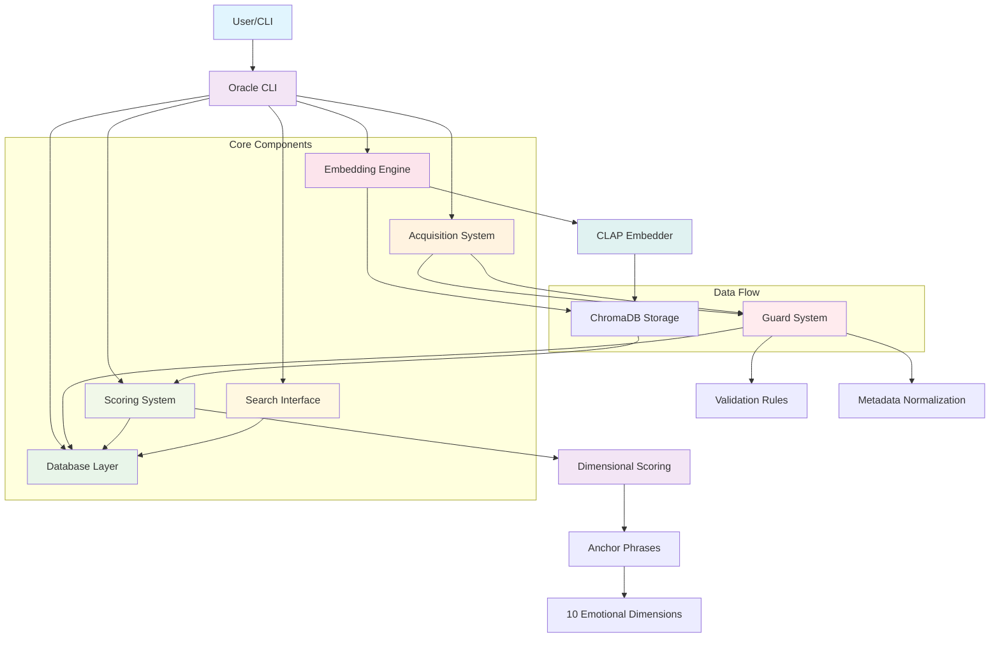

# Lyra Oracle System Architecture

## Overview
Lyra Oracle is a semantic music intelligence system that transforms music libraries into AI-powered knowledge bases with semantic search, intelligent curation, and natural language playlist generation.

## Component Diagram

## Detailed Component Descriptions

### 1. User Interface Layer
- **Oracle CLI**: Unified command-line interface for all system operations
- **API Endpoints**: Web API routes (currently in API-first mode)

### 2. Core Processing Components

#### Database Layer (`oracle/db/`)
- SQLite-based storage with optimized performance settings
- Manages music library metadata, embeddings, and scores
- Handles database migrations and connection pooling

#### Acquisition System (`oracle/acquirers/`)
- Multiple acquisition backends (yt-dlp, spotdl, qobuz, realdebrid)
- **Guard System**: Pre-flight validation before any track enters the library
  - Rejects junk content (karaoke, tribute tracks)
  - Validates against MusicBrainz/Discogs 
  - Normalizes metadata
  - Detects duplicates
  - Verifies audio quality

#### Embedding Engine (`oracle/embedders/`)
- Uses CLAP model for audio embedding generation
- Processes audio files into semantic embeddings stored in ChromaDB

#### Scoring System (`oracle/scorer.py` + `oracle/anchors.py`)
- Implements dimensional scoring across 10 emotional/sonic dimensions:
  - Energy, Valence, Tension, Density, Warmth, Movement, Space, Rawness, Complexity, Nostalgia
- Uses anchor phrases to map embeddings to dimension scores

#### Search Interface (`oracle/search.py`)
- Enables semantic search through natural language queries
- Leverages ChromaDB for vector similarity searches

### 3. Data Flow Process

1. **Acquisition**: Music is downloaded from various sources
2. **Validation**: Guard system validates and normalizes tracks before acceptance  
3. **Embedding**: Audio files are processed to generate CLAP embeddings
4. **Scoring**: Tracks receive dimensional scores based on anchor phrases
5. **Storage**: All metadata, embeddings, and scores are stored in the database
6. **Search/Discovery**: Semantic queries can be performed against indexed content

## Key Features

- **Semantic Search**: Natural language queries like "aggressive distorted guitars with screaming vocals"
- **Vibes System**: Dynamic playlist generation from semantic queries  
- **Intelligent Curation**: AI-powered library organization
- **Multi-source Acquisition**: Support for YouTube, Spotify, Qobuz, RealDebrid, etc.
- **Quality Control**: Guard system prevents junk content (karaoke, tribute tracks)
- **Emotional Scoring**: 10-dimensional emotional analysis of music

## System Architecture Principles

### Modularity
Each component is designed to be modular and replaceable:
- Different acquisition backends can be swapped in/out
- Embedding models can be changed without affecting other components
- Database schema can evolve independently

### Safety & Quality Control
The Guard system acts as the gatekeeper for all acquisitions, ensuring only quality content enters the library.

### Performance Optimization
- SQLite with WAL mode and optimized cache settings
- ChromaDB for efficient vector similarity searches  
- Parallel processing where appropriate (thread pools)